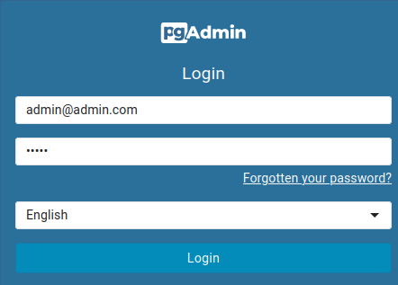
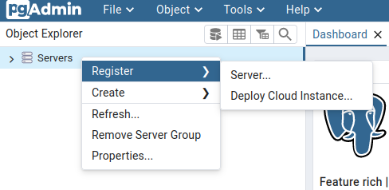
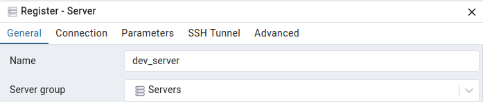
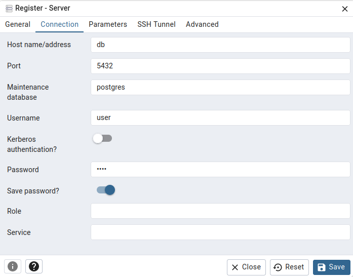
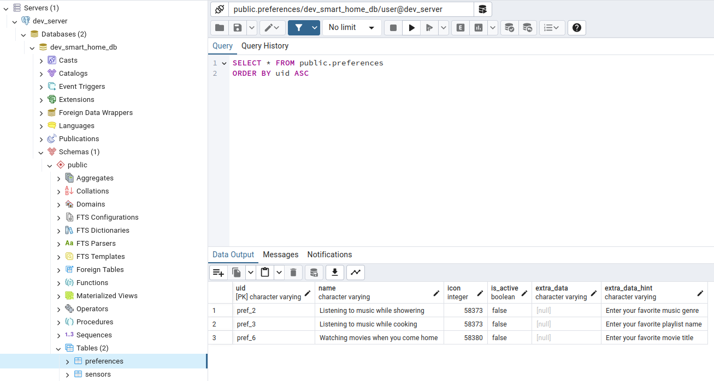
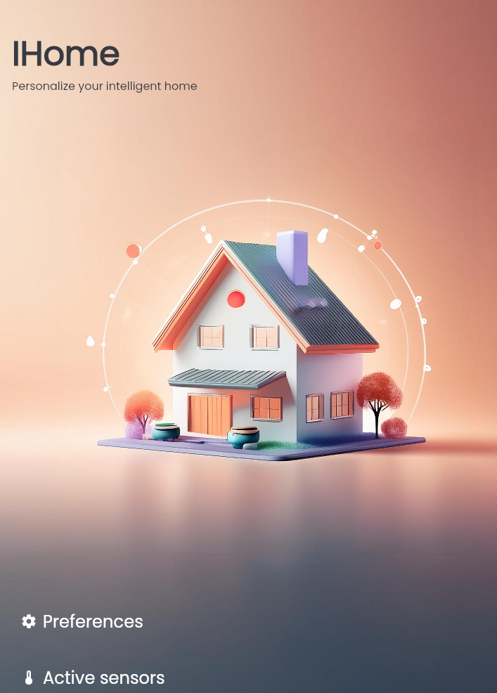
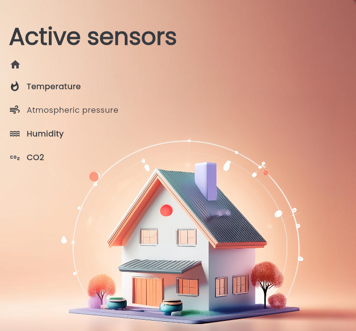

# IHome

A full-stack, Generative AI powered mobile application which helps people control activities & sensors of their smart IoT home systems.
IHome depends on the backend, a RESTFul API built with Django which uses a local PostgreSQL database.

<hr>

## Running & setup
### Prerequisites
Before running IHome, ensure you have the following installed:
* [Flutter SDK](https://flutter-ko.dev/get-started/install)
* [Docker](https://docs.docker.com/compose/install/)

### App setup
Clone the application from GitHub.
```bash
git clone https://github.com/NikolaOgnjenovic/EESTech.git
```

#### Backend setup
Navigate to the backend directory and run docker-compose.yml.
```bash
cd backend
docker-compose up --build
```

#### Frontend setup
```bash
cd ../frontend
flutter pub get
```
To run IHome on a connected device or emulator, use the following command:
```bash
flutter run
```

#### API documentation
When the application starts, you can access the [Swagger documentation](http://localhost:5000/apidocs/).

#### Accessing data via pgAdmin
Go to the [pgAdmin web UI](http://localhost:5050/browser/) and login with the following credentials:
```
admin@admin.com
admin
```



Right click the *Servers* row and press *Create* in the *Register* menu.



Name the server any way you want.



Enter the following values:
*db* for the host name/address
*user* for the username anad password
Afterwards, press *Save*.



View the tables by opening the *dev_smart_home_db* database, the *public* schema and the *tables* collection.



### App usage
When you run the flutter application, you will be presented with a home screen with buttons that lead to two menus.



The first button takes you to the *Preferences* screen, on which you can toggle preferences that you have for the system:
the system will adhere to them and prioritise them when performing actions after analyzing data.

Some preferences also have optional input which is used to enhance the action that the system takes when performing one based on a user preference.
For example, if the system is playing music when it detects that someone is showering, it will play the song that the user manually inputed, or a hardcoded one otherwise.


The second button on the homepage takes yo uto the *Sensors* screen, on which you can toggle sensors that collect different types of data and
enhance the experience of the user in the home system.


